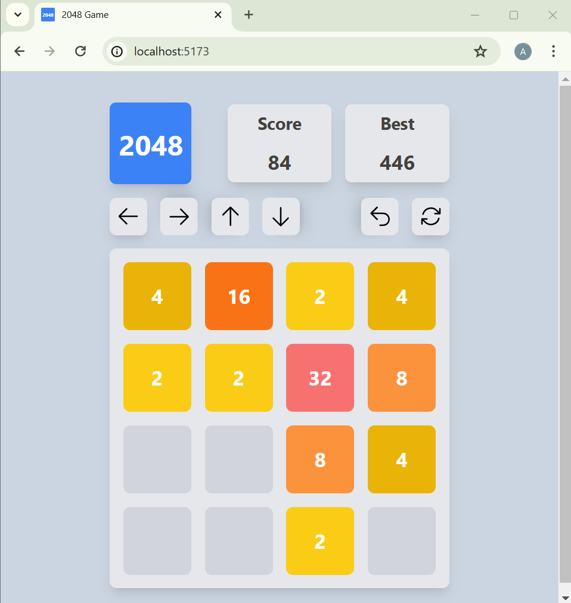

# 2048 Game

A 2048 game implemented in React with Tailwind CSS. This project demonstrates the use of React for game logic and Tailwind CSS for styling. Additionally, swipe gestures are supported for mobile devices using the `react-swipeable` library.

## Video

[](video.mp4)


## Table of Contents

- [Installation](#installation)
- [Usage](#usage)
- [Game Rules](#game-rules)
- [Project Structure](#project-structure)
- [Technologies Used](#technologies-used)
- [Contributing](#contributing)
- [License](#license)

## Installation

To get started with this project, clone the repository and install the necessary dependencies:

```bash
git clone https://github.com/abolfazlbzgh/game-2048.git
cd game-2048
npm install
```


## Usage
To run the project locally, use the following command:

```bash
npm run dev
```
This will start the development server and you can view the game in your browser at http://localhost:5173.

## Game Rules

- Use the arrow buttons or swipe gestures (on mobile devices) to move the tiles.
- Tiles with the same number merge into one when they touch.
- The goal is to create a tile with the number 2048.

## Project Structure
```arduino
react-2048/
├── public/
│   ├── icons
│   └── ...
├── src/
│   ├── components/
│   │   ├── Board.jsx
│   │   ├── Game.jsx
│   │   ├── Tile.jsx
│   │   ├── Button.jsx
│   │   ├── Modal.jsx
│   │   └── Score.jsx
│   ├── index.css
│   ├── main.jsx
│   └── App.jsx
├── tailwind.config.js
├── package.json
└── README.md
```
## Components
- `Board.jsx`: Renders the game board and tiles.
- `Game.jsx`: Manages the game state and handles user input.
- `Tile.jsx`: Represents individual tiles on the board.
- `Button.jsx`: Represents individual buttons.

## Technologies Used
- [React](https://react.dev/): A JavaScript library for building user interfaces.
- [Tailwind CSS](https://tailwindcss.com/): A utility-first CSS framework for styling.
- [react-swipeable](https://www.npmjs.com/package/react-swipeable): A library for handling swipe gestures.

## Contributing
Contributions are welcome! Please fork the repository and submit a pull request for any enhancements or bug fixes.

1. Fork the repository
2. Create a new branch (`git checkout -b feature-branch`)
3. Commit your changes (`git commit -m 'Add some feature'`)
4. Push to the branch (`git push origin feature-branch`)
5. Open a pull request

## License
This project is licensed under the MIT License. See the [LICENSE](./LICENSE.txt) file for details.